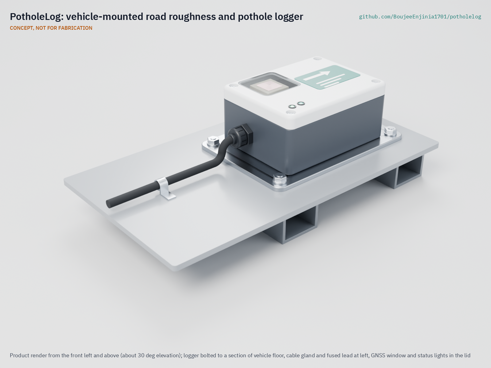

# PotholeLog

  

**Area:** Smart Cities · **TRL:** 3 of 9 (proof of concept on paper) · **Prototype budget:** about $75 USD · **Difficulty:** 2 of 5

A vehicle-mounted road roughness logger for buses, garbage trucks or bikes that records vibration with location to map potholes and rough roads as the fleet drives its routes.

[Exploded render](media/render-exploded.png) · [Detail render](media/render-detail.png) · [Interactive 3D model](media/viewer.html) · [Concept blueprint (PDF)](media/concept-blueprint.pdf) · [General arrangement (PDF)](cad/drawings/PHL-DWG-001.pdf) · [Calculations](docs/04-calcs/01-sizing.md) · [Review note](docs/REVIEW.md)

## Concept rationale

Fleets already cover the road network every week, and a small sensor turns routine trips into a road survey. PotholeLog is a sealed box bolted to the floor of a bus or refuse truck above the rear axle. It logs vertical acceleration at 400 Hz with GNSS position, reports a roughness value for every 100 m of road and flags sharp impacts as possible potholes. Many passes by many vehicles are averaged, and each vehicle is calibrated on a few reference sections to give an estimate on the International Roughness Index (IRI) scale, following the method the World Bank set out for response-type roughness meters ([Technical Paper 46](https://documents1.worldbank.org/curated/en/851131468160775725/pdf/multi-page.pdf)).

It is open and garage-buildable because the agencies with the least survey money most need the data, and the parts are ordinary: an ESP32 board, an IMU breakout, a GNSS module, a vehicle DC-DC converter and a stock IP65 box, for $71 in parts (indicative). Open firmware and an open data format let a city check how its road map was made and let others improve the detection method on the same raw data.

## Burning platform

Many road networks carry a large share of rough pavement. In the United States in 2023, about 25 % of the reported mileage of urban "other principal arterials" had an IRI above 170 in/mi (2.7 m/km), the level treated as poor (computed from [FHWA Highway Statistics, table HM-64](https://www.fhwa.dot.gov/policyinformation/statistics/2023/hm64.cfm)). In England, local authorities rated 17 % of their unclassified roads as needing maintenance to be considered in the year to March 2025 ([Department for Transport](https://www.gov.uk/government/statistics/road-conditions-in-england-to-march-2025)). Yet most local streets are surveyed rarely, so repairs follow complaints.

The stakes go beyond vehicle damage. Road crashes kill about 1.16 million people a year, 92 % of them in low- and middle-income countries, and more than half of those killed are pedestrians, cyclists and motorcyclists ([WHO](https://www.who.int/news-room/fact-sheets/detail/road-traffic-injuries)), the road users most exposed to potholes and broken surfaces. The same WHO fact sheet estimates that crashes cost most countries 3 % of gross domestic product.

## Where it could be used

### By industry

| Industry | Use |
| --- | --- |
| Municipal road maintenance | Weekly roughness and pothole map from the city's own fleet to plan patching and resurfacing |
| Public transit | Buses log the corridors they use most, and the agency can show where rough roads affect ride comfort and wear |
| Waste collection | Refuse trucks reach nearly every residential street on a weekly cycle, covering the roads surveys visit least |
| Road agencies and development programs | Low-cost condition data for network planning where survey vans are unaffordable |
| Fleet maintenance | Relate suspension and tyre wear to the roughness of each vehicle's routes |
| Universities and civic tech groups | Open raw data for research on detection methods and road equity |

### By country or region

| Country or region | Why it matters there |
| --- | --- |
| United States | About a quarter of urban principal arterial mileage rated above the poor IRI level in 2023 ([FHWA HM-64](https://www.fhwa.dot.gov/policyinformation/statistics/2023/hm64.cfm)); cities have large bus and refuse fleets to host loggers |
| England and the United Kingdom | 17 % of local unclassified roads needed maintenance to be considered in 2024/25 ([DfT](https://www.gov.uk/government/statistics/road-conditions-in-england-to-march-2025)); councils already publish condition data |
| Sub-Saharan Africa | Road traffic death rates are highest in the WHO African Region ([WHO](https://www.who.int/news-room/fact-sheets/detail/road-traffic-injuries)); minibus fleets cover dense networks where survey budgets are small |
| India | Road accidents attributed to potholes numbered 4,775 in 2019 and 3,564 in 2020, according to the road transport ministry's reply in the Lok Sabha ([PIB, 16 December 2021](https://pib.gov.in/PressReleasePage.aspx?PRID=1782178)); fleet data could locate defects before they cause crashes |
| Brazil | The 2025 CNT survey of 114,197 km of federal and main state highways rated the pavement fair, poor or very poor on 56.5 % of that length ([CNT, Pesquisa CNT de Rodovias 2025](https://repositorio.itl.org.br/jspui/bitstream/123456789/847/1/Pesquisa%20CNT%20de%20Rodovias%202025%20-%20S%C3%ADntese%20dos%20resultados%20-%20nacional,%20por%20regi%C3%A3o%20e%20por%20estados.pdf)); fleet loggers could extend condition data to city streets |
| Canada | About 13 % of public road length was in poor or very poor condition in 2020 ([Statistics Canada, Core Public Infrastructure Survey](https://www150.statcan.gc.ca/n1/daily-quotidien/220524/dq220524a-eng.htm)); municipal transit and refuse fleets could survey local roads weekly |

## What sparked the idea

The starting point was the International Road Roughness Experiment, held around Brasília, Brazil, in May and June 1982 by research teams from Brazil, the United Kingdom, France, the United States and Belgium. On 49 test sections, from asphalt to earth roads, it compared rod-and-level surveys and profilometers with seven response-type roughness systems, five of them roadmeters fitted to ordinary passenger cars, and the results became the basis of the International Roughness Index ([Sayers, Gillespie and Queiroz, World Bank Technical Paper 45, 1986](https://documents1.worldbank.org/curated/en/326081468740204115/pdf/multi-page.pdf)). The experiment showed that an everyday vehicle, calibrated on a few reference sections, can measure roughness on a common scale. PotholeLog applies that finding to the buses and refuse trucks that already drive every street, with an open, low-cost sensor in place of a mechanical roadmeter.

## Problem

Road surveys are expensive and infrequent, so repairs follow complaints rather than condition. Full problem statement: [docs/01-problem.md](docs/01-problem.md)

## Concept

A vehicle-mounted road roughness logger for buses, garbage trucks or bikes that records vibration with location to map potholes and rough roads as the fleet drives its routes. This build targets buses and refuse trucks on vehicle power, with summaries uploaded over depot Wi-Fi; a bicycle variant, which needs its own battery and mount, is a later step (decided by Amish, 2026-09-25).

The TRL 3 calculations ([PHL-CAL-001](docs/04-calcs/01-sizing.md)) give 0.54 W running, 112 kB of summaries a day, 133 to 160 days of raw data on a 32 GB card, 7 s of hold-up and $71.00 in parts against a $75 budget. They also found two limits, both settled by Amish's 2026-09-25 decisions ([PHL-DDR-002](docs/decisions/0002-recommendations-accepted.md)). A bus tyre bridges most of a 300 mm pothole, so small potholes are found reliably only at low speed; the defect-detection range is now 10 to 30 km/h, relying on repeat slow passes near stops and junctions. The converter is now rated 60 V, so it survives a load dump on a 24 V vehicle, with a thin 1.9 V margin over the TVS clamp. Detection accuracy and calibration remain unverified until field data exist.

Full design precis: [docs/02-concept.md](docs/02-concept.md) · Requirements: [docs/03-requirements.md](docs/03-requirements.md) · Decisions: [PHL-DDR-001](docs/decisions/0001-trl2-review-decisions.md), [PHL-DDR-002](docs/decisions/0002-recommendations-accepted.md) · Parametric model: [cad/src/model.py](cad/src/model.py)

## Key components

- 6-axis IMU (LSM6DSO class) fixed to the enclosure floor
- GNSS module with patch antenna and PPS output (u-blox M10 class)
- ESP32-S3 controller with Wi-Fi and microSD storage
- 60 V-rated vehicle DC-DC converter (9 to 36 V supplies) with fuse, TVS and reverse-polarity protection, plus a hold-up supercapacitor
- Stock IP65 enclosure, 120 x 90 x 55 mm, on a 160 x 110 x 4 mm aluminum mounting plate

The working bill of materials is in [bom/bom.csv](bom/bom.csv).

## Safety

> Bolt the mounting plate through at existing fixing points so nothing can detach in a crash or hard stop, and never cut or weld structural members. Wire only to a fused, ignition-switched circuit with the battery isolated during installation, and route the lead away from moving parts and sharp edges. Do not fit a converter rated below 60 V to a 24 V vehicle. Never interact with the device while driving. Location data can reveal drivers' movements: publish only road-level results. This is a research prototype, not certified to automotive standards. See [docs/02-concept.md](docs/02-concept.md#safety).

## Repository layout

| Folder | Contents |
| --- | --- |
| `docs/` | Problem, concept, requirements, calculations and design decisions |
| `cad/src/` | build123d Python source, the source of truth for all geometry |
| `cad/step/`, `cad/stl/` | Exported models for FreeCAD, other CAD tools and printing |
| `cad/drawings/` | 2D sketches and dimensioned drawings |
| `bom/` | Bill of materials |
| `electronics/` | KiCad schematics and PCB layouts |
| `firmware/` | Microcontroller code |
| `media/` | Renders, perspectives and photos |
| `build-log/` | Dated prototyping notes |

## Documentation

Controlled documents follow the portfolio [documentation standard](.kit/STANDARDS.md). Each carries a document ID (PHL-PRC-001 for the precis), a version and a revision history. Branded PDFs are built with `python .kit/render.py` and attached to GitHub Releases when a document is tagged, for example `PHL-PRC-001/v1.0`.

## Credits

Designed by Amish Chadha. See [CONTRIBUTORS.md](CONTRIBUTORS.md) for roles. To cite this design, use [CITATION.cff](CITATION.cff) (GitHub shows it as "Cite this repository").

AI assistance (Claude) was used to accelerate concept renders, prototype documentation and first-pass sizing calculations. Design direction and all decisions are Amish Chadha's, recorded in this repository's decision records (`docs/decisions/`).

## Licenses

- **Hardware** (CAD, drawings, BOM, electronics): [CERN-OHL-S v2](LICENSE)
- **Software** (firmware, scripts, notebooks): [MIT](LICENSE-SOFTWARE)

A project of the [Design Molecule](https://designmolecule.com) lab.
