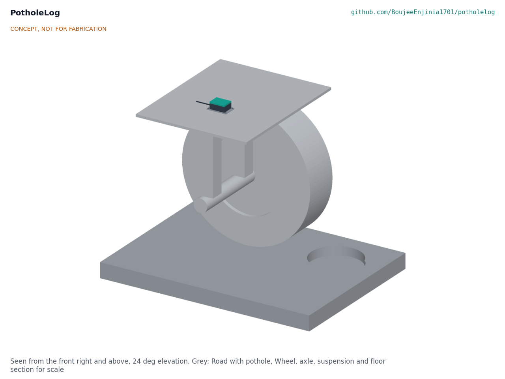
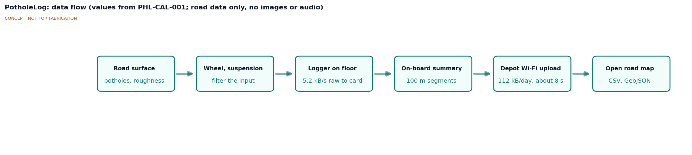
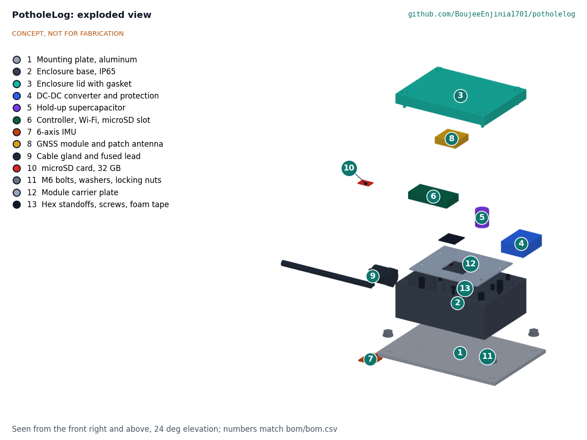
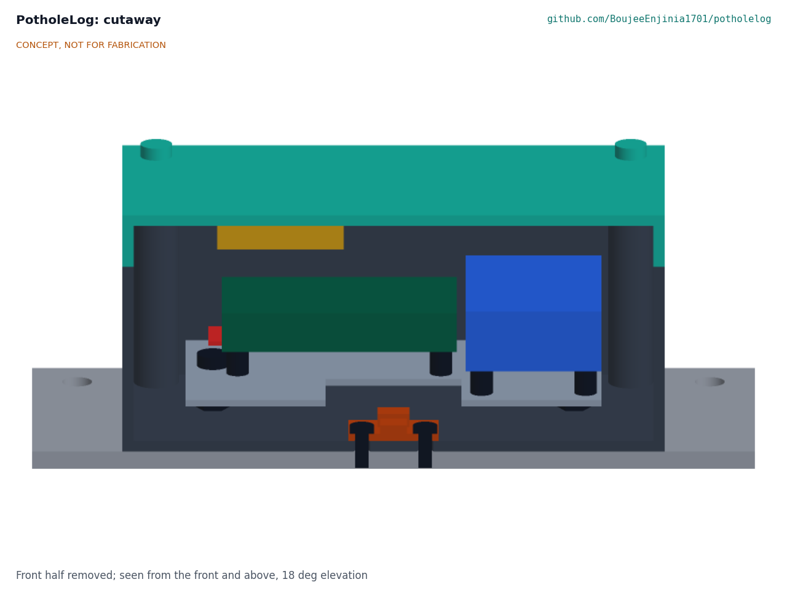
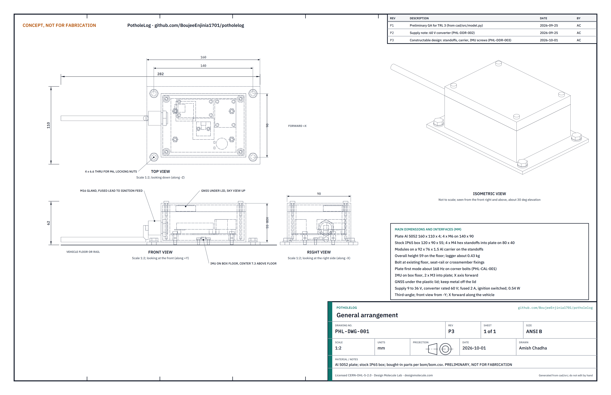

# PotholeLog design precis

## Summary

PotholeLog is a sealed box, 120 x 90 x 55 mm on a 4 mm plate (59 mm overall), bolted to the floor of a bus or refuse truck above the rear axle. It records how the vehicle shakes and where it is, turns each 100 m of road into a roughness value and flags sharp impacts as possible potholes, then uploads a small daily file over depot Wi-Fi. Averaged over many passes and calibrated per vehicle, the data gives a city a weekly map of road condition on every street its fleet drives. The TRL 3 calculations (PHL-CAL-001) show that off-the-shelf modules meet the sampling, storage, hold-up and power needs for an estimated $74 in parts, $1 under the $75 value-engineering target, and that the roughness signal is well above sensor noise. They also found two limits, both now addressed by Amish's 2026-09-25 decisions (PHL-DDR-002). A bus tyre bridges most of a 300 mm pothole, so the floor-mounted logger finds the R1 reference pothole only at low speed (up to about 20 km/h on a fair road, 50 km/h on a good one); small potholes are therefore sought on slow passes, 10 to 30 km/h, near stops and junctions. The converter is now rated 60 V so that it survives a load dump on a 24 V vehicle. Detection accuracy and calibration to IRI remain unverified until field data exist. On 2026-10-01 the design was made constructable (PHL-DDR-003): the modules now sit on a carrier plate held by the four hex standoffs that fix the box to the mounting plate, and the build is described component by component in the prototype build plan ([PHL-BLD-001](05-build-plan.md)).

Figure 1. Concept massing model. The logger is the small dark box on the floor section; the grey scene is for scale.

## How it works

1. **Sense.** A 6-axis IMU rigidly fixed to the enclosure floor samples acceleration at 400 Hz. A GNSS module under the lid logs position and speed at 10 Hz.
2. **Log raw data.** Raw samples go to a microSD card as a rolling buffer, so any detection can be re-run later with a better algorithm.
3. **Summarize on board.** For every 100 m traveled, the controller computes a roughness value from the vertical acceleration (band-limited RMS from 0.5 to 20 Hz, tagged with its speed band for calibration), and records the segment's start and end, speed and the number of samples. Sharp vertical impacts above a threshold are stored as defect events, with most small potholes expected from slow passes at 10 to 30 km/h near stops and junctions (R5) with position, speed and peak size; the front and rear axle impacts of the same defect, about 0.4 to 0.7 s apart in town, are paired to confirm the event and place it at the rear axle.
4. **Upload.** When the vehicle is back within depot Wi-Fi with the ignition on, on arrival or at the next start, the controller joins the network and uploads the day's summaries (about 112 kB, about 8 s) to the fleet's server. The hold-up capacitor cannot power Wi-Fi long enough to upload after the ignition is switched off.
5. **Calibrate and aggregate.** On the server, each vehicle's raw roughness is converted to an IRI estimate using a calibration equation found on reference sections, in the way World Bank Technical Paper 46 describes for response-type systems ([Sayers et al., 1986](https://documents1.worldbank.org/curated/en/851131468160775725/pdf/multi-page.pdf)). Events from several passes and vehicles are clustered; a cluster seen on repeated passes becomes a reported defect, as in Pothole Patrol ([Eriksson et al., 2008](https://doi.org/10.1145/1378600.1378605)).
6. **Publish.** The city publishes a map of segment roughness and defect clusters as CSV and GeoJSON, for its own GIS and for CityTwin. Vehicle tracks and timestamps stay on the operator's server.

Figure 2. Data flow. Values from PHL-CAL-001.

## Main components

Table 1. Main components. Numbers match the exploded view (Figure 3), `cad/src/model.py` and `bom/bom.csv`.

| # | Component | Proposed choice | Notes |
| --- | --- | --- | --- |
| 1 | Mounting plate | 160 x 110 x 4 mm aluminum, 4 x M6 on 140 x 90 mm; tapped for the box standoffs and the IMU screws | Bolts to existing crossmember, seat-rail or floor fixings; first mode about 168 Hz on corner bolts |
| 2 | Enclosure base | Stock IP65 ABS or polycarbonate box, 120 x 90 mm, with corner lid-screw pillars | Held to the plate by four M4 hex standoffs through its floor (PHL-DDR-003) |
| 3 | Enclosure lid | Supplied with the box, with gasket | GNSS antenna under the lid; plastic lid keeps sky view through vehicle windows |
| 4 | DC-DC converter and protection | 9 to 60 V in (60 V rated), 5 V 1 A out; TVS diode, reverse-polarity diode, input fuse | Covers normal 12 V and 24 V supplies and a 24 V suppressed load dump (58 V), clearing the TVS clamp by 1.9 V (PHL-DDR-002, N1) |
| 5 | Hold-up supercapacitor | 1 F, 5.5 V, rated to 70 °C or more | About 7 s at end of life to close files when power drops |
| 6 | Controller | ESP32-S3 board with Wi-Fi and microSD slot; module variant rated to 85 °C | Decided by Amish, 2026-09-25 (PHL-DDR-001, D4) |
| 7 | IMU | 6-axis, LSM6DSO class, ±16 g, 400 Hz or more | On the box floor, held by two M3 screws through the floor into the plate; gyroscope helps separate body roll and pitch from vertical motion |
| 8 | GNSS module | u-blox M10 class with patch antenna, 10 Hz, PPS output | Under the lid on a foam tape pad; PPS time-stamps the IMU samples |
| 9 | Cable gland and fused lead | M16 gland, 2 m lead, inline 2 A fuse | Wired to an ignition-switched fused circuit |
| 10 | microSD card | 32 GB high-endurance, -25 to 85 °C | 133 to 160 days of raw data |
| 11 | Fixings | 4 x M6 (8.8) with locking nuts and washers | Crash load is small; loosening needs a later test |
| 12 | Module carrier plate | 92 x 76 x 1.5 mm aluminum with a window over the IMU | Carries the converter, supercapacitor and controller (PHL-DDR-003) |
| 13 | Box fixing kit | 4 x M4 hex standoffs, screws, nylon standoffs, foam tape, sealant | Added for construction (PHL-DDR-003) |

Figure 3. Exploded view with numbered callouts matching the BOM.

Figure 4. Cutaway on the plane through the IMU. The IMU sits on the enclosure floor, the controller, supercapacitor and converter behind it, and the GNSS module under the lid.

Figure 5. General arrangement PHL-DWG-001, Rev P3, generated from `cad/src/model.py` ([PDF](../cad/drawings/PHL-DWG-001.pdf)). Preliminary, not for fabrication.

## Key numbers

All values are from PHL-CAL-001 v0.3 (`docs/04-calcs/sizing.py`), which states the assumptions; they are calculations for review, not measurements.

Table 2. Key numbers.

| Quantity | Value | Basis | Requirement |
| --- | --- | --- | --- |
| Sample spacing on the road | 35 mm at 50 km/h, 56 mm at 80 km/h | 400 Hz | R6 |
| Samples across a 300 mm pothole | 9 at 50 km/h, 5 at 80 km/h | Length divided by spacing | R1 |
| Tyre drop into a 300 mm pothole | 22 mm, whatever its depth | 1.04 m tyre, rigid-circle envelope | R1 |
| Pothole detection margin | Above 1 up to about 20 km/h (IRI 4) and 50 km/h (IRI 2); in the 10 to 30 km/h band, 1.94 or more (IRI 2) and 0.97 at 30 km/h (IRI 4) | Quarter-car model against roughness crossing once per km | R1, R5 at risk |
| Roughness signal against noise | 12 times at 20 km/h on a smooth road | 0.5 to 20 Hz band | R5 |
| Synthetic calibration | r² 0.93 from one pass, 0.99 from five | 40 sections, IRI 1 to 8 m/km | R3 |
| Location, 95 % | 2.3 m suburban, 18.2 m dense urban (10 passes) | M10-class GNSS with PPS | R4 at risk |
| Raw data | 5.23 kB/s; 188 MB per 10 h day | 6 axes x 16 bit at 400 Hz, plus GNSS and time stamps | |
| Raw storage on a 32 GB card | 133 to 160 days | 10 to 12 h of driving a day | R7 met |
| Summaries per day | 112 kB, uploaded in about 8 s | 200 km, 48 B segments, 500 events at 32 B | R8 met |
| Running power | 0.54 W; 1.42 W for about 8 s while uploading | Loads 91 mA at 3.3 V, linear regulator, 85 % converter | R9 |
| Supply current | 45 mA at 12 V, 22 mA at 24 V | From running power | |
| Hold-up time | 10.0 s new, 7.0 s at end of life | 1 F from 4.7 V to 3.6 V | R10 met; 1 s needed |
| Inside temperature | About 72 °C at +70 °C ambient | 2.0 K self-heating | R11 at risk |
| Plate first mode | 168 Hz on corner bolts | 4 mm aluminum, 140 mm span | R12 met on paper |
| Installation | 30 min | Task estimate | R12 at the limit |
| Size | 120 x 90 x 55 mm box on a 160 x 110 x 4 mm plate, 59 mm overall | `cad/src/model.py` | |
| Mass | 0.43 kg; 0.57 kg with lead and fixings | Model volumes and module masses | |
| Converter input rating | 60 V against a 58 V suppressed load dump and a 58.1 V TVS clamp | ISO 16750-2 test B levels, to confirm | R9 at risk (TVS pulse energy) |
| Parts cost | $74.00 | `bom/bom.csv` | R15 met: $1.00 under the $75 value-engineering target |

## Key design choices

The choices below were proposed at TRL 2 and decided by Amish on 2026-09-25 (go with recommendation; PHL-DDR-001 and PHL-DDR-002).

- **Sprung-mass mount on the floor, not on the axle.** The floor is clean, dry and easy to reach, and the GNSS can see the sky through the windows. The axle would give a stronger, less filtered signal but sees large shocks, water and stones. Calibration per vehicle corrects for the suspension. PHL-CAL-001 supports the choice: the axle would see about 9 g, 65 times the floor peak.
- **Depot Wi-Fi upload, not cellular.** It keeps parts cost near the value-engineering target and avoids data plans. Cellular (for example an LTE-M module) would give same-day data but adds about $20 to $30 per unit and a monthly fee; it stays an optional add-on, costed separately.
- **Raw data kept on the card.** Storage is cheap, and raw data lets the detection method improve without new hardware.
- **Summaries and events, not tracks, leave the vehicle's operator.** Only road-level results are published (R13).
- **Controller, IMU and GNSS.** ESP32-S3 (Wi-Fi, low cost, wide community), an LSM6DSO-class IMU and a u-blox M10-class GNSS. The alternatives considered were an RP2040 board with a separate Wi-Fi module and an nRF52 board with a phone or gateway for upload.
- **100 m segments and point events, in CSV and GeoJSON** following the CityTwin open data export.
- **60 V converter input.** A 60 V-rated converter replaces the 36 V part so that a 24 V suppressed load dump does not destroy it; about $2 more, with `budget_usd` raised from $70 to $75 (PHL-DDR-002, N1). A surge-stopper front end would be more robust and was not chosen.
- **Slow-pass defect detection.** The R5 defect-detection range is 10 to 30 km/h, with the 300 mm reference defect kept, because buses slow near stops and junctions and pass each spot many times (PHL-DDR-002, N2).
- **Bicycles later.** This build serves buses and refuse trucks; a bicycle variant with its own battery and mount is a later step, and the pitch is unchanged.
- **Built on existing lab work where it fits.** Outputs follow the CityTwin open data export so PotholeLog segments can appear on the CityTwin map; CityTwin is built on TwinKit. PotholeLog does not use FieldNode, because it runs from vehicle power rather than solar and uploads at the depot rather than over LoRaWAN.

## Safety

> **Safety:** PotholeLog is fitted to vehicles that carry passengers and operate in traffic.
>
> - **Secure mounting.** A loose box can become a projectile in a crash or hard stop. Bolt the plate through with M6 bolts and locking nuts at existing fixing points, never with adhesive or magnets alone. Do not cut, drill or weld chassis members or safety-critical structure; follow the fleet operator's and vehicle maker's rules for body fittings.
> - **Vehicle electrics.** Connect only to a fused, ignition-switched circuit through the inline fuse, with the battery isolated during installation. Route the lead away from moving parts, hot surfaces and sharp edges, and protect it where it passes through panels. A short on a 24 V vehicle supply can start a fire. The converter is now rated 60 V for a 24 V suppressed load dump (PHL-DDR-002), but the margin over the TVS clamp is only 1.9 V and the TVS pulse energy is untested; do not fit a converter rated below 60 V to a 24 V vehicle.
> - **Working on vehicles.** Install only with the vehicle parked, secured and switched off. Never work under a vehicle supported only by a jack.
> - **Driver distraction.** The logger has no controls or display and must not be handled while the vehicle is moving.
> - **Sharp edges.** Deburr the aluminum plate.
> - **Supercapacitor.** It stays charged for a short time after power is removed; do not short its terminals.
> - **Data.** Vehicle location data can reveal where drivers are and when. Keep tracks on the operator's server under the operator's data policy, inform drivers and unions before a pilot, and publish only road-level results.
>
> This is a research prototype. It is not certified to automotive electrical or EMC standards, and its outputs must not be used for contract acceptance or safety decisions without validation against a calibrated reference.

## Open questions

- Does the TVS survive a 24 V load dump pulse with the 60 V converter, or is a surge stopper needed (R9)? Needs a bench test (TRL 4, on hold).
- Are slow passes near stops and junctions frequent enough to meet R1 with the 10 to 30 km/h detection band (R5)? Needs field data.
- How far off is GNSS in the partner city's densest streets, and is map matching needed for R4?
- How will CityTwin receive the operator's daily segment files, given that its gateway accepts no inbound connections? To agree with CityTwin.
- Which host fleet and city for a first pilot, and who provides reference IRI? Proposed, awaiting Amish.
- Should a bicycle variant be developed later, and with what battery and mount (R16)?

Concept media: [blueprint sheet](../media/concept-blueprint.pdf), [interactive 3D model](../media/viewer.html). Calculations: [PHL-CAL-001](04-calcs/01-sizing.md). Decisions: [PHL-DDR-001](decisions/0001-trl2-review-decisions.md).
