# PotholeLog prototype build plan

**Plan, not yet built.** How to build the first proof-of-concept prototype, component by component. Building and testing to it is TRL 4 work. Decisions still to be made are kept in the design decisions register ([docs/06-design-decisions.md](06-design-decisions.md)), not here.

## 1. What you are building

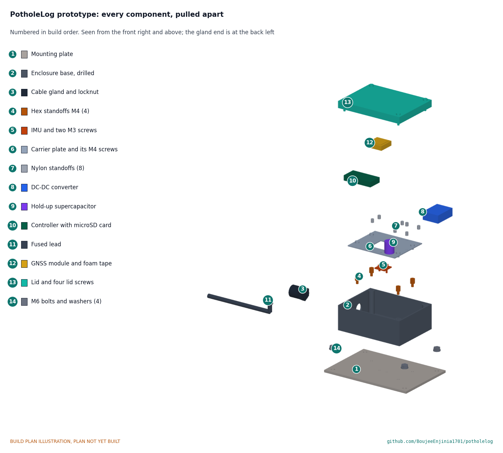

*Figure 1. Every component pulled apart and numbered in build order.*

The prototype is one PotholeLog on a bench board that stands in for the vehicle floor: a grey plastic box, 120 x 90 x 55 mm, on a 4 mm aluminium plate that bolts down at its four corners. Inside, a small motion sensor (the IMU) is screwed through the box floor into the plate, so it feels exactly what the plate feels, and an aluminium carrier plate above it holds the power converter, the hold-up capacitor and the controller. The position module (GNSS) sits under the plastic lid, where it sees the sky. Figure 1 shows the 14 components in the order you make or fit them. Three are made in a small workshop: the mounting plate, the carrier plate and the drilling of the bought box. Everything else is bought and fitted: the box and lid, cable gland, hex standoffs, electronic modules, memory card, fused lead and bolts. The work is sawing, drilling, tapping and filing aluminium sheet, drilling a plastic box, and wiring bought modules together at screw terminals and plugs. The parts cost about $74 from the bill of materials.

> **Safety:** The logger runs from a vehicle's 12 V or 24 V supply. On the bench, power it only from a bench supply with a 2 A fuse in the lead and the current limit set to 0.5 A; never from a vehicle until the stops of section 6 are passed. The hold-up capacitor stays charged for a short time after power is removed: do not short its terminals. Cut aluminium edges are sharp; deburr everything. Installing on a vehicle is outside this plan.

## 2. What changed to make it buildable

The concept showed what the logger does; some of its parts overlapped or had no fixing. Each change below keeps what the logger does, and all of them are recorded in decision record PHL-DDR-003, open for Amish's review.

*Table 1. Changes from the concept.*

| Component | The concept had | The buildable design has | Why |
| --- | --- | --- | --- |
| Box fixing | Four screws through the box floor, two of them under the converter and all four where a stock box has its corner pillars | Four hex standoffs through the floor into the plate, 80 x 40 mm apart (Figure 6) | Nothing sits on a screw head; the standoffs also carry the carrier plate |
| Modules | Converter and capacitor standing loose on the floor; controller on a support that was not a part | An aluminium carrier plate on the standoffs, with the modules on nylon standoffs and a window over the IMU (Figures 8 and 9) | Bought modules are made to be screwed to a plate |
| Layout inside the box | The capacitor overlapping the controller; the controller touching the end wall where the gland nut goes | Converter turned and moved to the front; every module at least 2 mm from the next and well clear of the gland nut (Figure 3) | Same box, same modules, nothing overlaps |
| Cable gland | Drawn against the outside of the wall, with no hole or nut | A 16.2 mm hole with the gland's seal outside and its locknut inside (Figure 5) | This is how a gland is fitted |
| IMU | Screwed to the plastic floor, with no screws shown | Two M3 screws through the floor into the aluminium plate (Figure 7) | Clamped to the plate the vehicle shakes; still on the floor, on the centre line |
| GNSS module | Floating under the lid | Held by a pad of foam tape under the lid top (Figure 10) | No hole in the lid |
| Lid | Fixing not shown | The box's four corner pillars and lid screws, with every part kept clear of them (Figure 11) | They are on the box that will be bought |

## 3. Making the components

Make and check each component before the assembly step that needs it. Sizes are in millimetres. "Forward" is toward the front of the vehicle, the end of the box without the gland; "left" and "right" are as seen facing forward. Positions are measured from the centre lines of the plate or box. Workshop tolerance is 0.5 mm unless a step says otherwise; drawings do not carry tolerances before TRL 4.

### 3.1 Mounting plate

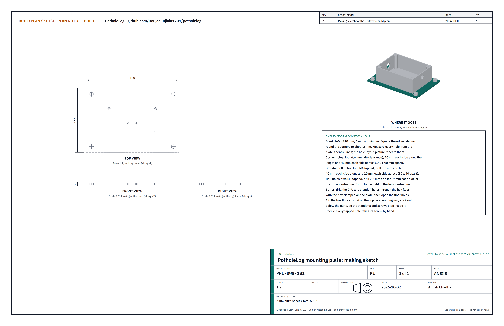

*Figure 2. Mounting plate making sketch (PHL-DWG-101).*

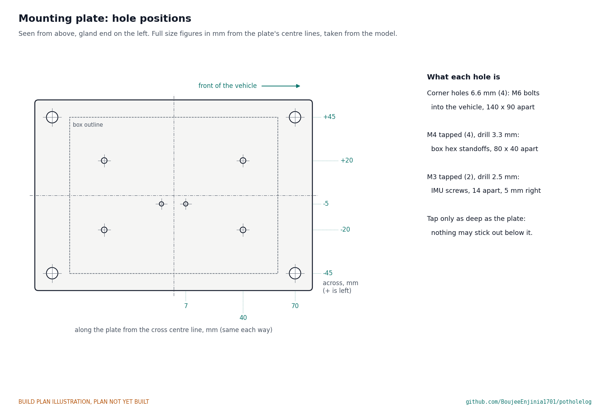

*Figure 2a. Every hole, full size figures, measured from the plate's centre lines.*

**What it is and what it is made from.** The flat plate the whole logger stands on and bolts down by. Aluminium sheet 4 mm thick, 5052 class, cut to 160 x 110 mm.

**How to make it.**

1. Cut the blank to 160 x 110 mm, square. File the edges and round the corners to about 2 mm.
2. Scribe both centre lines on the top face and mark the forward end.
3. Corner holes: four 6.6 mm holes, 70 mm each side of the cross centre line and 45 mm each side of the long centre line (140 x 90 mm apart).
4. Standoff holes: four holes 40 mm each side along and 20 mm each side across (80 x 40 mm apart). Drill 3.3 mm and tap M4 right through.
5. IMU holes: two holes 7 mm each side of the cross centre line, 5 mm to the right of the long centre line. Drill 2.5 mm and tap M3 right through.
6. Deburr every hole on both faces.

**How it fits the parts next to it.** The box floor sits flat on the top face, centred, held by the four standoffs (Figure 6); the IMU screws come down through the floor into the M3 holes (Figure 7). The four corner bolts sit 4 mm outside the box ends (Figure 12). Nothing may stick out below the plate, so it sits flat on the vehicle floor.

**Check before moving on.** Each tapped hole takes its screw by hand, and the plate lies flat on a bench without rocking.

### 3.2 Enclosure base, drilled, with its cable gland

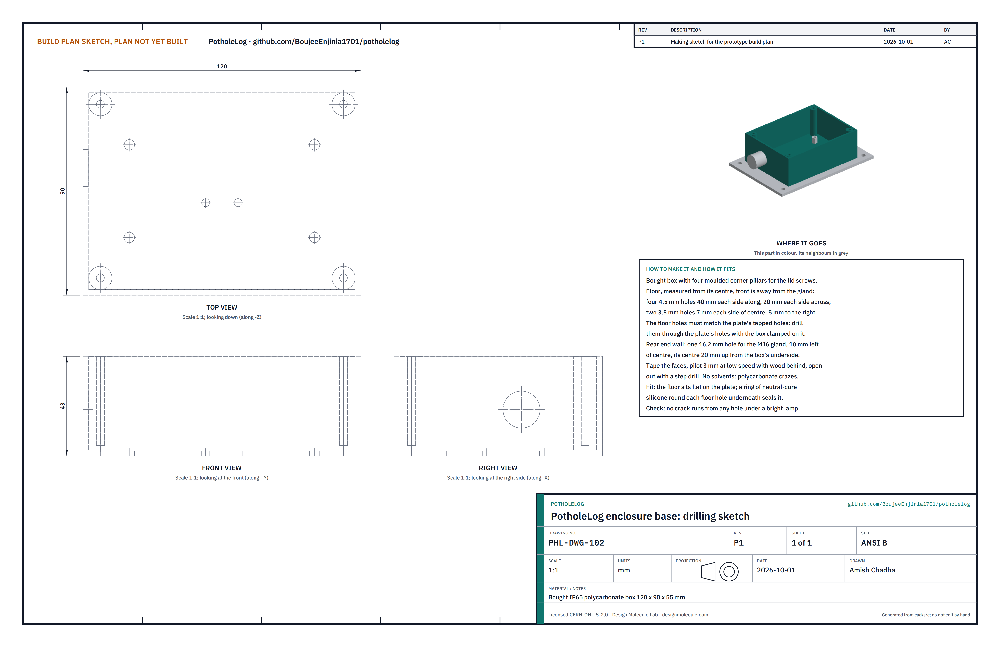

*Figure 3. Enclosure base drilling sketch (PHL-DWG-102).*

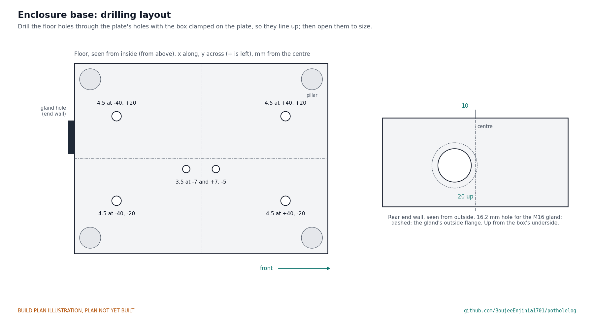

*Figure 4. Floor holes and the gland hole in the rear end wall.*

**What it is and what it is made from.** A bought grey polycarbonate box, 120 x 90 x 55 mm with its lid, rated IP65, with four moulded pillars in its corners for the lid screws. Six holes are drilled in its floor and one in its rear end wall.

**How to make it.**

1. Clamp the box, centred and square, on the mounting plate, rear end over the plate's rear end.
2. From inside the box, drill through the plate's four standoff holes and two IMU holes with a 2.5 mm drill, just deep enough to mark the plate's holes through the floor. Unclamp.
3. Open the four standoff holes in the floor to 4.5 mm and the two IMU holes to 3.5 mm with a step drill, at low speed and light pressure, with a block of wood under the floor.
4. Rear end wall: cover it with masking tape, mark a point 10 mm left of the centre and 20 mm up from the box's underside, pilot 3 mm, and open to 16.2 mm with the step drill. Check the size against the gland's datasheet before the last step.
5. Deburr inside and out. Clean with water and mild soap only; solvents craze polycarbonate.

**How it fits the parts next to it.**

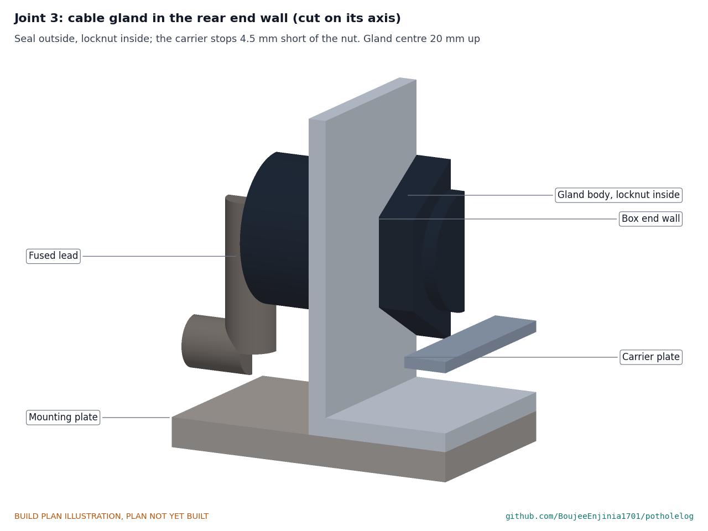

*Figure 5. The gland's body and seal sit outside the wall; its locknut is inside, 4.5 mm clear of the carrier plate.*

The gland goes in from outside with its sealing washer against the wall and its locknut inside (step 1). The floor sits flat on the plate; a ring of neutral-cure silicone under each floor hole seals it (step 2).

**Check before moving on.** No crack runs out from any hole under a bright lamp; with the box clamped back on the plate, every floor hole lines up with its plate hole.

### 3.3 Hex standoffs (bought, 4)

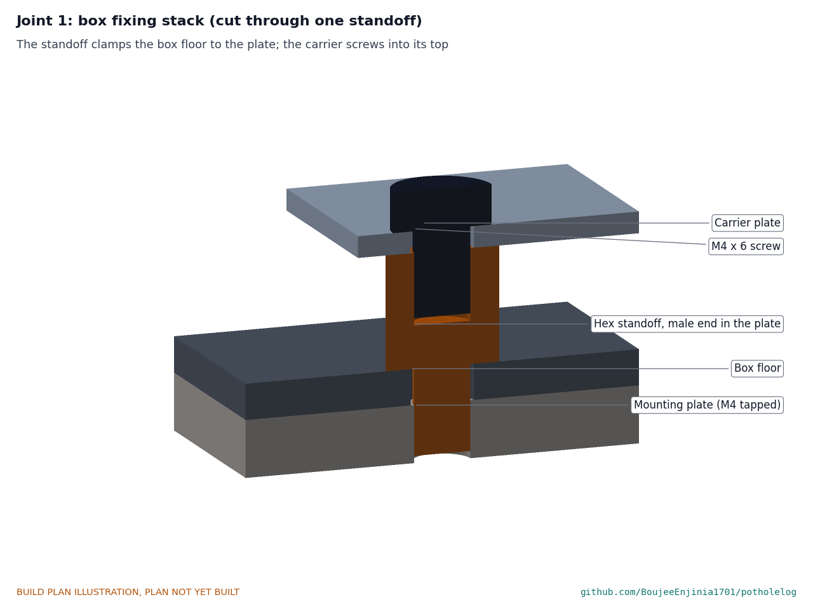

*Figure 6. Each standoff's threaded end goes through the box floor into the plate and clamps the floor down; the carrier plate screws onto its top.*

**What to buy and how it fits.** Four M4 male-female hex standoffs, brass or stainless, 7 mm across the flats, 8 mm body and a 6 mm male thread (no longer, or the thread would come out under the plate). The male end goes through the 4.5 mm floor hole into the plate's tapped hole; the body stands on the floor. The carrier plate sits on their tops, 8 mm above the floor, and four M4 x 6 pan-head screws go into their female threads.

**Check before moving on.** All four tops are level within 0.5 mm, checked with a straightedge across them.

### 3.4 IMU (bought)

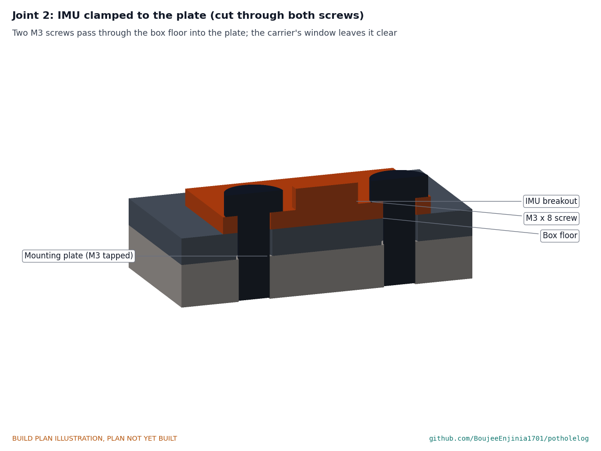

*Figure 7. Two M3 screws pass through the IMU board and the box floor into the plate.*

**What to buy and how it fits.** A 6-axis IMU breakout of the LSM6DSO class, about 20 x 20 mm, with two mounting holes 14 mm apart (or drill the floor and plate to the holes of the board you buy) and a side-entry plug for its lead, so nothing stands more than about 5 mm above the floor. It sits flat on the box floor with the arrow printed for its forward axis pointing forward, held by two M3 x 8 pan-head screws into the plate. Its top stays 3.4 mm below the carrier plate, and the carrier's window gives room for its lead.

**Check before moving on.** The board does not rock; the screw tips do not show under the plate.

### 3.5 Module carrier plate and the modules on it

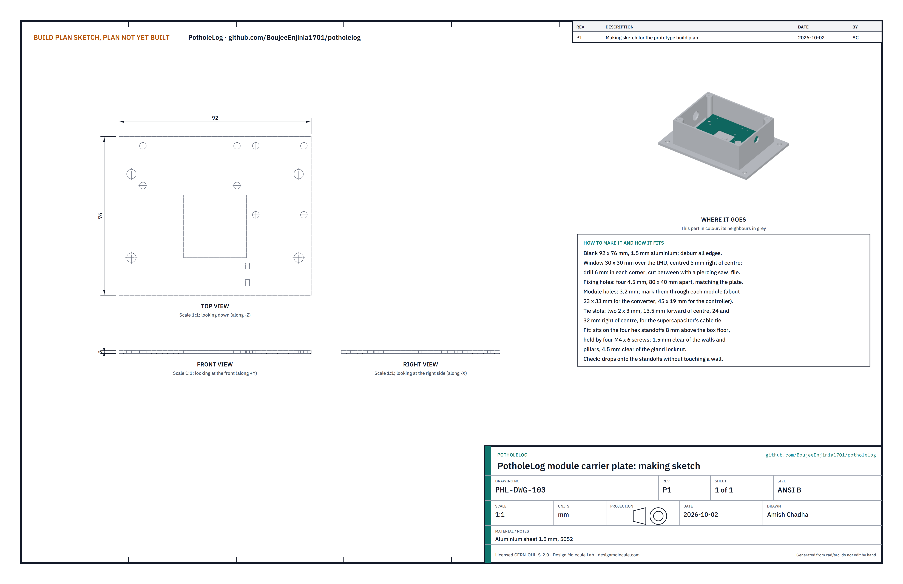

*Figure 8. Module carrier plate making sketch (PHL-DWG-103).*

**What it is and what it is made from.** A thin plate that carries the converter, the hold-up capacitor and the controller above the IMU. Aluminium sheet 1.5 mm thick, 5052 class, cut to 92 x 76 mm.

**How to make it.**

1. Cut the blank to 92 x 76 mm; deburr every edge.
2. Fixing holes: four 4.5 mm holes, 80 x 40 mm apart, matching the plate. Best: clamp the carrier on the plate and drill through the plate's standoff holes, then open to 4.5 mm.
3. Window: 30 x 30 mm, centred 5 mm right of the centre. Drill a 6 mm hole in each corner, cut between them with a piercing saw or nibbler, and file the edges straight.
4. Lay the converter (front left) and the controller (rear left) on the plate as Figure 9 shows, mark each module's mounting holes through the module, and drill them 3.2 mm. For the expected modules they are about 23 x 33 mm apart for the converter and 45 x 19 mm for the controller.
5. Tie slots: two 2 x 3 mm slots, 15.5 mm forward of centre, 24 and 32 mm right of centre, beside where the capacitor stands. Drill 2 mm and file.

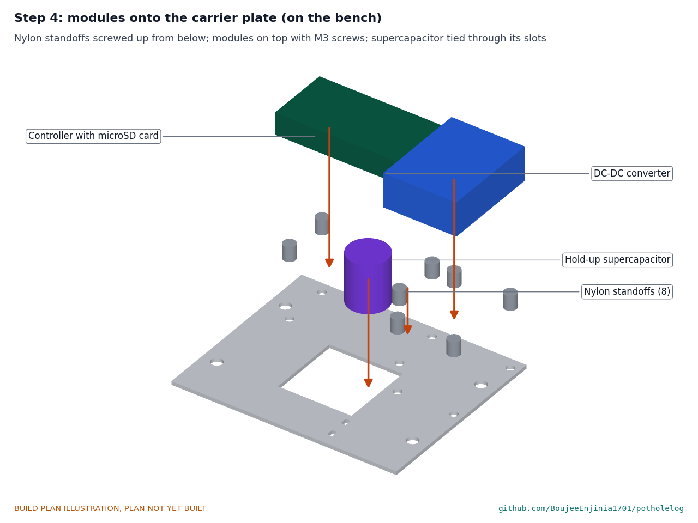

*Figure 9. Where each module goes on the carrier.*

**How it fits the parts next to it.** The carrier sits on the four hex standoffs (Figure 6), 1.5 mm clear of the box walls and corner pillars and 4.5 mm clear of the gland locknut (Figure 5). Each module stands on four 6 mm M3 nylon standoffs, screwed up through the carrier from below; the modules are screwed down onto them with M3 screws. The capacitor stands on the carrier and is held by a cable tie through the two slots.

**Check before moving on.** The carrier drops onto the standoffs without touching a wall or pillar, and nothing on it touches the next part.

#### 3.5.1 Wiring

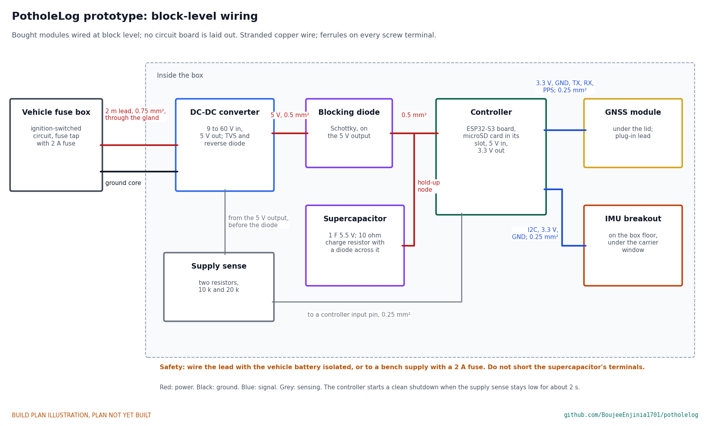

*Figure 9a. Block-level wiring with wire sizes. No circuit board is laid out; bought modules are wired together.*

Wire it like this, with stranded copper and a ferrule on every screw terminal:

1. The fused lead's live core to the converter's input terminal, its ground core to the converter's ground: 0.75 mm² (18 AWG), the lead's own cores.
2. Converter 5 V output to the blocking diode, and the diode to the controller's 5 V pin: 0.5 mm² (20 AWG).
3. The capacitor to the controller's 5 V pin through its 10 ohm resistor, with the bypass diode across the resistor so the capacitor can feed the controller when power drops: 0.5 mm².
4. Supply sense: a 10 k and a 20 k resistor in series from the converter's 5 V output (before the blocking diode) to ground; the joint between them to a controller input pin: 0.25 mm² (24 AWG).
5. IMU to the controller's 3.3 V, ground and I2C pins with its plug-in lead, up through the carrier window: 0.25 mm².
6. GNSS plug-in lead (3.3 V, ground, transmit, receive and the timing pulse) to the controller, long enough to set the lid down beside the box: 0.25 mm².
7. Put the microSD card in the controller's slot.

**Check before moving on.** Every wire continues end to end; with no power connected, the converter input reads open between live and ground; every wire is labelled.

### 3.6 GNSS module (bought)

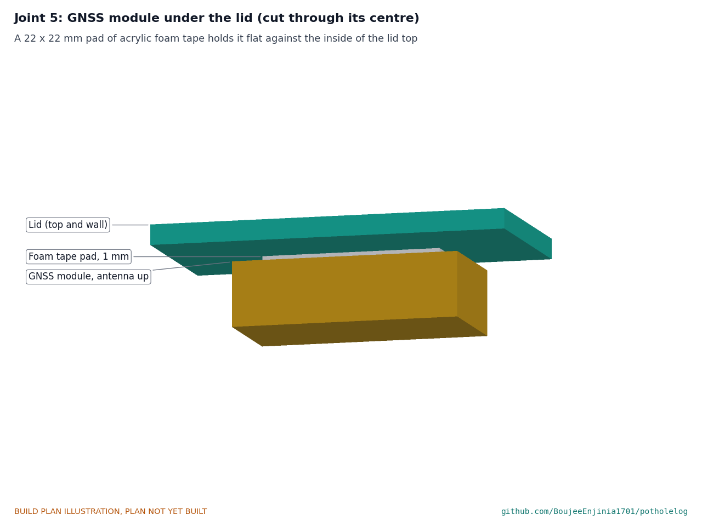

*Figure 10. A 22 x 22 mm pad of foam tape holds the module flat under the lid top.*

**What to buy and how it fits.** A u-blox M10 class GNSS module, no larger than 28 x 28 mm, with its patch antenna on top, a timing-pulse output and a plug-in lead. It goes under the lid top, 25 mm toward the rear and 20 mm left of the centre, above the controller, held by a 22 x 22 mm pad of 1 mm acrylic foam tape (step 7). Keep metal, labels and the lid screws away from the area above the antenna.

**Check before moving on.** The module does not move when pushed sideways with a finger.

### 3.7 Lid, lid screws and the box's corner pillars

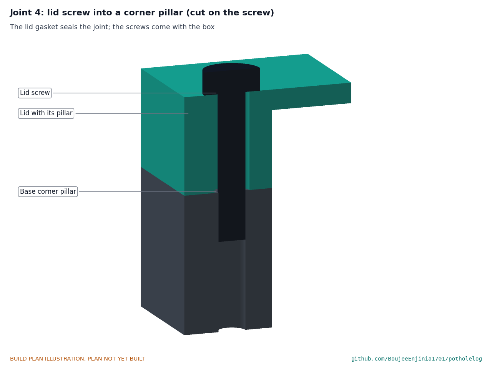

*Figure 11. Each lid screw passes through the lid's pillar into the base's pillar; the gasket in the lid seals the joint.*

**What to buy and how it fits.** The lid, gasket and four lid screws come with the box. The lid sits on the base's rim with its gasket between them; the four screws go into the moulded corner pillars. The modules stay clear of the pillars by 1.5 mm or more.

**Check before moving on.** The gasket sits in its groove all the way round, with no wire across it.

### 3.8 Bought components

Buy to specification, not brand. Line numbers are those of the bill of materials.

- **Enclosure base and lid (lines 2 and 3).** Polycarbonate or ABS, IP65 or better, 120 x 90 x 55 mm outside, flat floor, four moulded corner pillars and lid screws, gasketed lid.
- **DC-DC converter (line 4).** 9 to 60 V input (60 V rated), 5 V 1 A output, about 30 x 40 mm with four mounting holes; a 36 V-class transient suppressor and a reverse-polarity diode on its input.
- **Hold-up capacitor (line 5).** 1 F, 5.5 V, about 16 mm across and 20 mm tall, rated to 70 °C or more, with a 10 ohm resistor, a bypass diode and a Schottky blocking diode.
- **Controller (line 6).** ESP32-S3 board with Wi-Fi and a microSD slot, no larger than about 52 x 26 mm, module rated to 85 °C.
- **IMU (line 7) and GNSS (line 8).** As sections 3.4 and 3.6.
- **Cable gland and fused lead (line 9).** M16 IP68 nylon gland for 4 to 8 mm cable; 2 m two-core lead, inline 2 A blade fuse holder, fuse tap and ring terminals.
- **microSD card (line 10).** 32 GB high-endurance, rated -25 to 85 °C.
- **Hardware (line 11).** Four M6 x 20 bolts, property class 8.8, with washers and nyloc nuts (for the bench board, M6 x 30); hook-up wire 0.5 and 0.25 mm²; two resistors; heat shrink; cable ties.
- **Box fixing kit (line 13).** Four M4 hex standoffs as section 3.3; four M4 x 6 pan-head screws; two M3 x 8 pan-head screws; eight 6 mm M3 nylon standoffs with screws; a 22 x 22 mm pad of 1 mm acrylic foam tape; neutral-cure silicone sealant.

## 4. Putting it together

In each picture the parts already fitted are grey and the part being fitted is in colour, with an arrow showing the way it goes in.

### Step 1: cable gland into the rear end wall

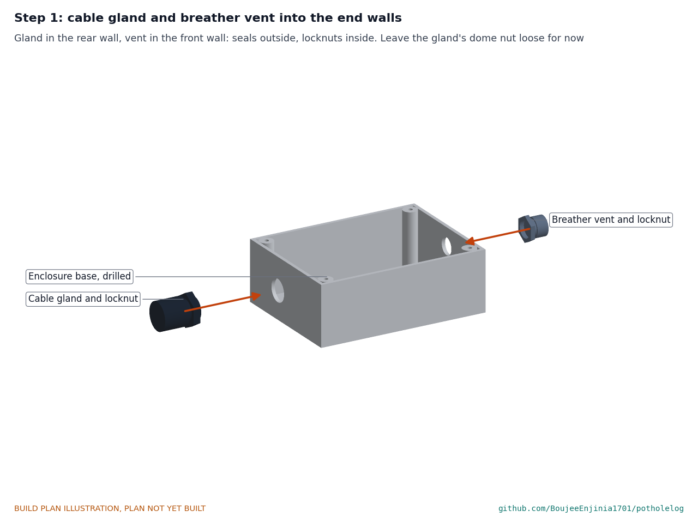

Gland body and sealing washer outside, locknut inside, tightened to the gland maker's torque. Leave the dome nut loose until step 6.

### Step 2: box onto the plate with four hex standoffs

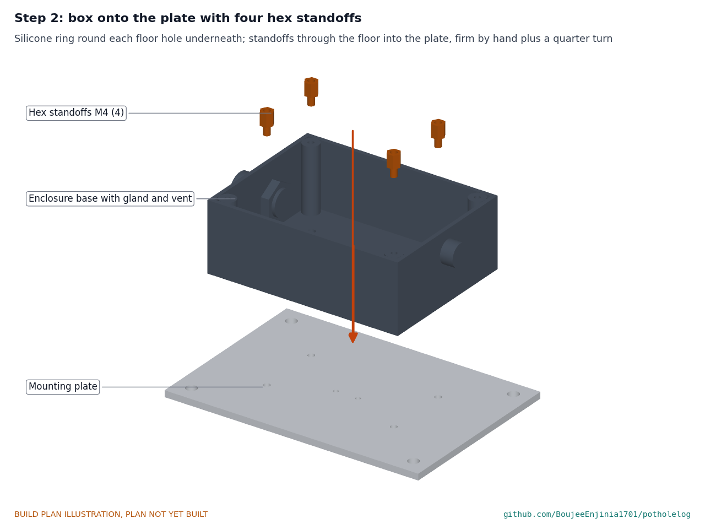

Put a thin ring of neutral-cure silicone round each of the four standoff holes and two IMU holes on the underside of the box floor. Set the box on the plate, holes lined up, and screw the four standoffs through the floor into the plate, firm by hand plus a quarter turn with a 7 mm spanner. Wipe off any silicone that squeezes out inside.

### Step 3: IMU onto the box floor

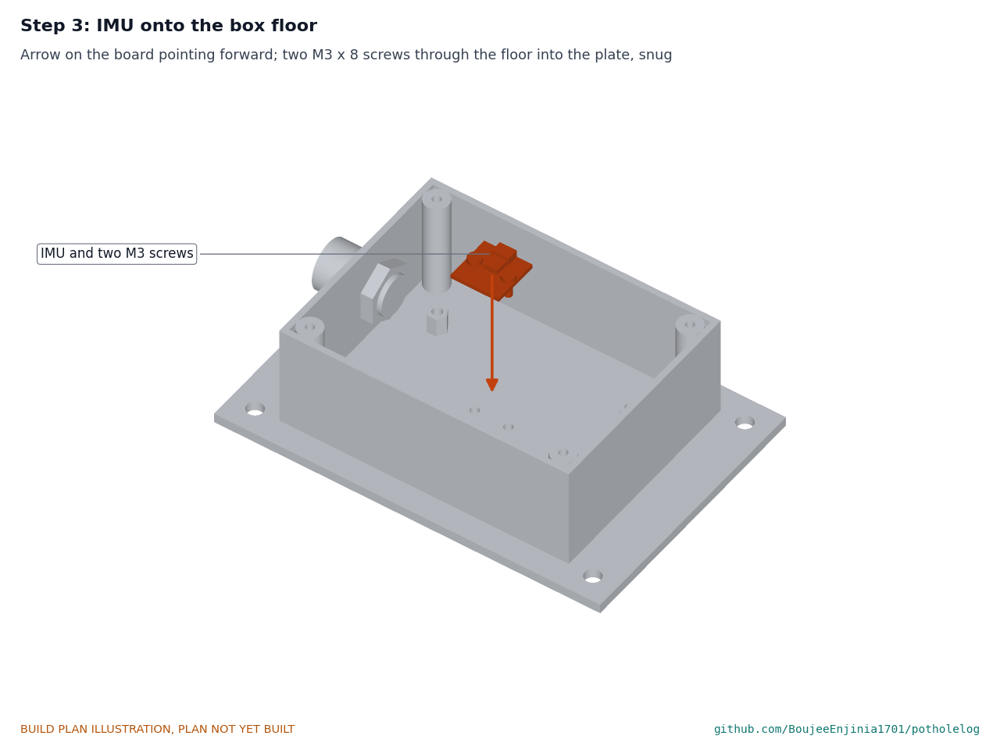

Board flat on the floor, its forward arrow pointing forward; two M3 x 8 screws through the board and floor into the plate, snug. **Hold point:** let the silicone cure for the time on its tube before going on.

### Step 4: modules onto the carrier plate (on the bench)

Screw the eight nylon standoffs up through the carrier from below. Fit the converter and controller on top with M3 screws; stand the capacitor beside the window and tie it through its slots. Wire the modules to each other as section 3.5.1, leaving the lead, IMU and GNSS connections for later.

### Step 5: carrier into the box

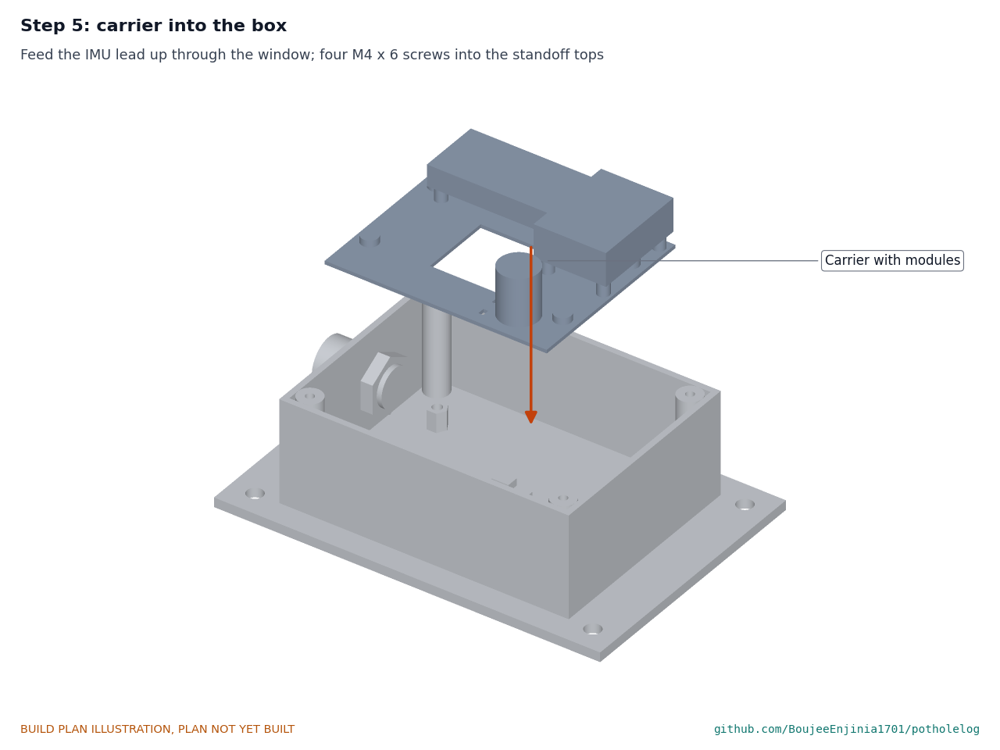

Feed the IMU lead up through the window, lower the carrier onto the standoff tops and fit four M4 x 6 screws. Plug in the IMU lead.

### Step 6: fused lead through the gland and wired

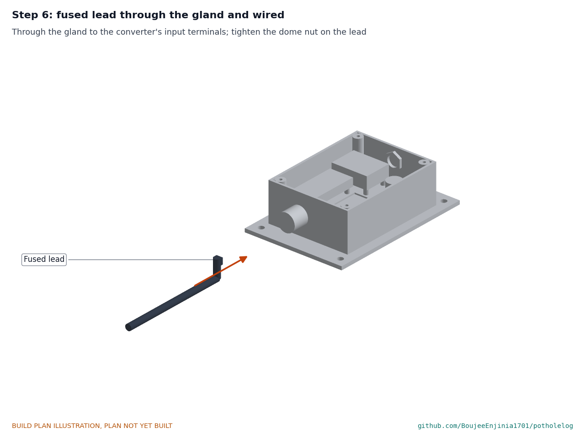

Pass the lead through the gland, strip it, crimp ferrules and connect it to the converter's input terminals, live and ground as marked. Leave about 40 mm of slack inside, then tighten the gland's dome nut on the lead. **Hold point:** the fuse holder at the far end of the lead has no fuse in it.

### Step 7: GNSS module under the lid

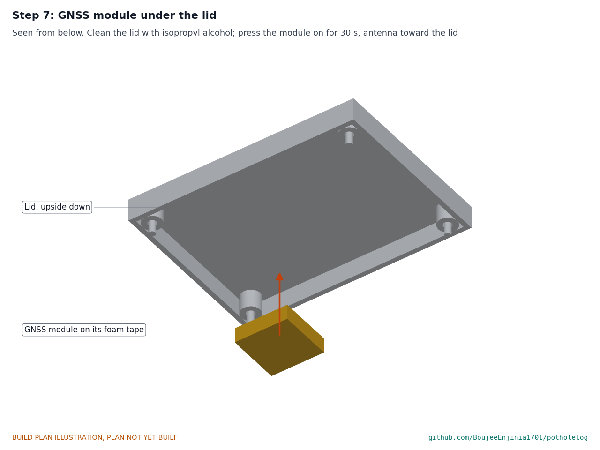

Clean the inside of the lid top with isopropyl alcohol and let it dry. Stick the tape pad to the module's underside, then press the module onto the lid, antenna toward the lid, for 30 seconds.

### Step 8: close the lid

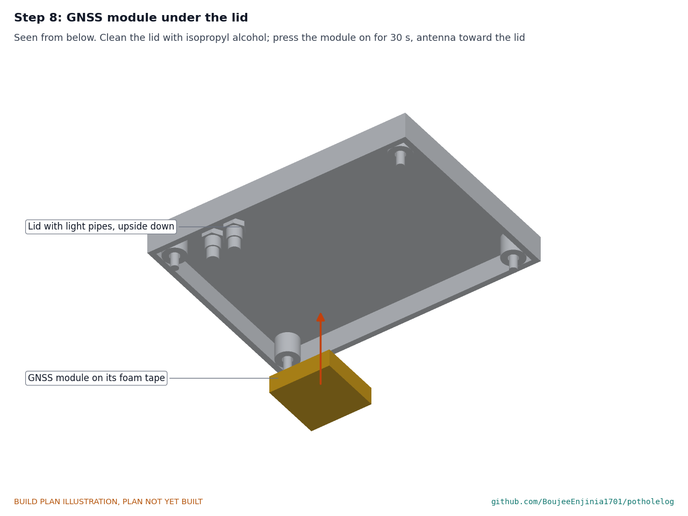

Plug the GNSS lead into the controller. Check the gasket is clean and seated with no wire across it, and tighten the four lid screws evenly in a cross pattern.

### Step 9: onto the bench board for the first checks

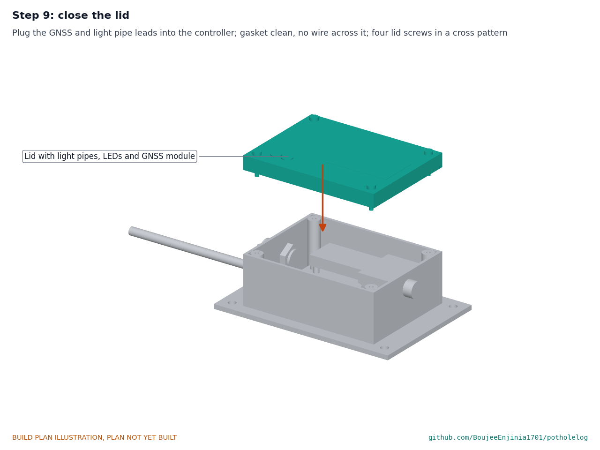

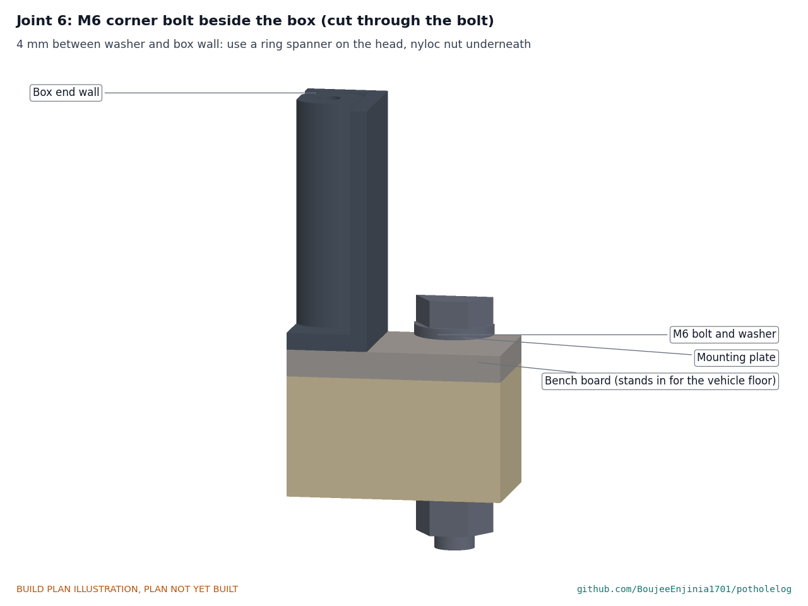

*Figure 12. There are 4 mm between each washer and the box: hold the bolt head with a ring spanner and tighten the nyloc nut underneath.*

Drill a 220 x 160 mm offcut of 18 mm plywood through the plate's corner holes. Four M6 x 30 bolts with washers from above, washers and nyloc nuts underneath, tightened with a ring spanner on the head and a socket on the nut.

## 5. First checks

These are the checks a TRL 4 test report would record; this plan only lists them. Requirement numbers are those of PHL-REQ-001.

*Table 2. First checks.*

| Check | Requirement | How | Pass when |
| --- | --- | --- | --- |
| Fit and seal | R11 | Look at the gasket, gland and floor holes under a lamp; tug the lead | Gasket seated all round; silicone ring visible round every floor hole; the lead does not move in the gland |
| Supply polarity and current | R9 | Bench supply at 12 V, current limit 0.5 A, 2 A fuse in the lead; then reversed for 5 s | About 45 mA when running; no current and no damage when reversed |
| Supply range | R9 | Bench supply at 9 V, 24 V and 32 V | Runs at each; current falls as voltage rises (about 22 mA at 24 V) |
| Hold-up and clean shutdown | R10 | Running and logging, switch the supply off; repeat 20 times | The controller closes its files every time; the card reads without errors on a computer |
| Sampling | R6 | Read the IMU and GNSS rates from the logged file with the board still | IMU at 400 Hz or more, GNSS at 5 Hz or more with the timing pulse present |
| Sensor coupling | R6 | Tap the bench board near the logger with a small hammer | A sharp vertical spike in the logged data with no ringing longer than about 20 ms |
| GNSS fix through the lid | R4 | Lid closed, by a window or outdoors | A position fix within the module maker's stated time |
| Upload | R8 | Ignition-on signal from the bench supply within range of a test Wi-Fi network | The day's summary file arrives on the test server |
| Mass | R12 | Weigh the logger without the lead | About 0.43 kg |

## 6. Safety stops

Stop at each point. Carry on only when everything listed is true.

- **S1. Before any supply is connected.** Every wire checked end to end; no fuse in the lead's fuse holder; the converter input reads open between live and ground; no bare conductor near the carrier or the plate.
- **S2. Before the first power.** A certified bench supply, current limit 0.5 A, voltage set to 12 V before connecting; a 2 A fuse in the lead's holder; the logger on the bench board, lid closed.
- **S3. Before any test above 30 V.** The converter's datasheet confirms a 60 V input rating; the bench supply cannot exceed 36 V. Load-dump pulse tests are TRL 4 work and need a proper surge generator, never a bench supply.
- **S4. After power is removed.** Wait 30 s before opening the lid, so the hold-up capacitor has discharged through the controller; never short its terminals.
- **S5. Before fitting to any vehicle (outside this plan).** All checks of section 5 passed; the vehicle parked, secured and switched off, battery isolated; bolted through at existing fixings into structure, never to a thin floor panel and never by cutting or welding structural members; the lead on a fused, ignition-switched circuit and routed clear of moving parts and hot surfaces; the fleet operator's agreement, including the data rules for drivers.

## 7. Tools, skills and workspace

**Tools.** Hacksaw or bandsaw with a fine blade; piercing saw or nibbler; bench vice with soft jaws; bench drill or a drill in a stand; drills 2 to 6.6 mm; step drill to 20 mm; M3 and M4 taps with tap wrench; flat and needle files; deburring tool; scriber, square, steel rule and calipers; 7 mm and 10 mm spanners, a 10 mm ring spanner and socket; screwdrivers; ferrule crimper and wire strippers; soldering iron; multimeter; bench power supply with an adjustable current limit (0 to 36 V, 0 to 2 A); kitchen scale to 1 kg.

**Skills.** No certified trade is needed. Basic metalwork (marking out, sawing, drilling, tapping, filing), careful drilling of plastic, crimping and through-hole soldering, and safe use of a bench power supply. All circuits are extra-low voltage: up to 36 V at the input and 5 V inside. No mains wiring is part of this build.

**Workspace.** A bench about 1.2 x 0.6 m; a metalwork corner kept apart from the electronics so chips stay off the modules; a ventilated spot for the silicone to cure.

**Personal protective equipment.** Safety glasses for cutting, drilling and soldering; gloves when handling cut sheet; no gloves near a turning drill.

## 8. Where the numbers come from

- Model and constructability checks: `cad/src/model.py` (`python cad/src/model.py --check`); STEP and STL exports in `cad/step/` and `cad/stl/`.
- Pictures: `cad/src/build_plan_media.py`, using `.kit/build_views.py`; written to `docs/05-build-plan/` and `cad/drawings/PHL-DWG-101` to `PHL-DWG-103`.
- General arrangement: `cad/drawings/PHL-DWG-001.pdf`, Rev P3.
- Calculations: `docs/04-calcs/01-sizing.md` (PHL-CAL-001 v0.3) and `docs/04-calcs/sizing.py`; power and supply current [F1], [F2], hold-up [G1], mass [H2], fixings [H3], plate stiffness [I1], spanner room [I4].
- Bill of materials: `bom/bom.csv`.
- Decisions: `docs/decisions/0003-design-for-construction.md` (PHL-DDR-003), with PHL-DDR-001 and PHL-DDR-002.
- Requirements: `docs/03-requirements.md` (PHL-REQ-001 v0.5).
